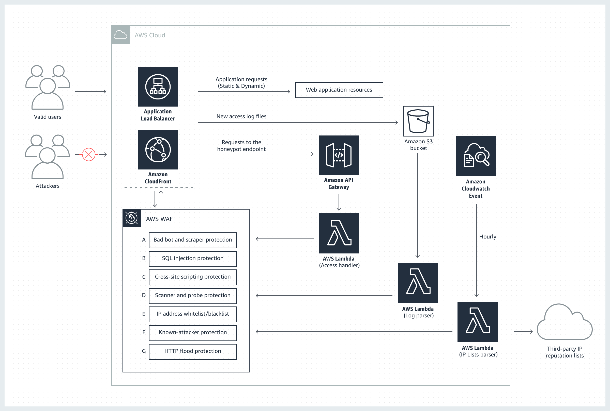

# Terraform AWS WAF

This module is based on [AWS WAF Security Automations](https://aws.amazon.com/cn/solutions/aws-waf-security-automations/) written in cloudformation. It is not so good for deploying cloudformation will take more than 15 min, and we use terraform writing our infrastructure.

## What does this AWS Solution do?

AWS WAF is a web application firewall that enables customers to quickly create custom, application-specific rules that block common attack patterns that can affect application availability, compromise security, or consume excessive resources. AWS WAF can be completely administered via APIs which makes security automation easy, enabling rapid rule propagation and fast incident response.

Configuring a web application firewall strategy can be challenging and burdensome to large and small organizations alike, especially for those who do not have dedicated security teams. To simplify this process, AWS offers a solution that uses AWS CloudFormation to automatically deploy a set of AWS WAF rules designed to filter common web-based attacks. Users can select from preconfigured protective features that define the rules included in an AWS WAF web access control list (web ACL), as depicted in the image to the right. Once the solution is deployed, AWS WAF will begin inspecting web requests to the user’s existing Amazon CloudFront distributions or Application Load Balancers, and block them when applicable.

## AWS Solution overview

The AWS WAF Security Automations solution provides fine-grained control over the requests attempting to access your web application. The diagram below presents the architecture you can build using the solution's implementation guide and accompanying AWS CloudFormation template.

At the core of the design is an AWS WAF web ACL that acts as central inspection and decision point for all incoming requests. The protective functions you choose to activate will determine the custom rules that are added to your web ACL.



## AWS WAF Security Automations solution architecture
Honeypot (A): This component creates a honeypot to lure and deflect content scrapers and bad bots. A discrete API Gateway endpoint (embedded in the web application) triggers a custom AWS Lambda function, which intercepts the suspicious request and adds the source IP address to the AWS WAF block list.

**SQL injection (B) and cross-site scripting (C) protection**: The solution automatically configures two native AWS WAF rules that protect against common SQL injection or cross-site scripting (XSS) patterns in the URI, query string, or body of a request.

**Log parsing (D)**: A custom AWS Lambda function automatically parses access logs to identify suspicious behavior and add the corresponding source IP addresses to an AWS WAF block list.

**Manual IP lists (E)**: This component creates two specific AWS WAF rules that allow you to manually insert IP addresses that you want to block (blacklist) or allow (whitelist).

**IP-list parsing (F)**: A custom AWS Lambda function automatically checks third-party IP reputation lists hourly for malicious IP addresses to add to an AWS WAF block list.

**HTTP flood protection (G)**: This component configures a rate-based rule that automatically blocks web requests from a client once they exceed a configurable threshold.

## Deployment

### Assumptions

You have correctly configure your aws account, and export aws secrets as envrionment variable.
```bash
export AWS_ACCESS_KEY_ID=xxxx
export AWS_SECRET_ACCESS_KEY=xxxx
```

### Usage example
1. example to use alb as endpoint
```hcl
module "testalb" {
  source                                    = "../../modules/alb"
  access_log_bucket                         = "test-bucket-alb"
  aws_region                                = "ap-southeast-1"
  sql_injection_protection_activated        = "yes"
  cross_site_scripting_protection_activated = "yes"
  http_flood_protection_activated           = "yes"
  scanner_probe_protection_activated        = "yes"
  reputation_lists_protection_activated     = "yes"
  bad_bot_protection_activated              = "yes"
}

```

2. example to use cloudfront as endpoint

```hcl
module "testcloudfront" {
  source                                    = "../../modules/cloudfront"
  access_log_bucket                         = "test-bucket-cloudfront"
  aws_region                                = "ap-southeast-1"
  sql_injection_protection_activated        = "yes"
  cross_site_scripting_protection_activated = "yes"
  http_flood_protection_activated           = "yes"
  scanner_probe_protection_activated        = "yes"
  reputation_lists_protection_activated     = "yes"
  bad_bot_protection_activated              = "yes"
}
```

### Run example

Deploy WAF ACL for ALB
```
cd examples/alb
terraform init
terraform plan
terraform run
```

Deploy WAF ACL for CloudFront
```
cd examples/cloudfront
terraform init
terraform plan
terraform run
```

---
**Referance:**
[AWS WAF Security Automations](https://aws.amazon.com/cn/solutions/aws-waf-security-automations/)
